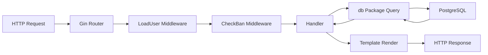

## Project Structure

```
oforum/
├── main.go                       # Entry point, routes, template setup
├── seed.go                       # Seed data generator
├── internal/
│   ├── auth/
│   │   ├── auth.go              # Password hashing, signup/login
│   │   └── middleware.go        # Session loading, auth guards
│   ├── models/
│   │   └── models.go            # All structs (User, Post, Comment, etc.)
│   ├── db/
│   │   ├── db.go                # Connection pool management
│   │   ├── users.go             # User queries (CRUD, profile, reputation)
│   │   ├── posts.go             # Post queries (ranked, new, search)
│   │   ├── comments.go          # Comment trees, add/delete
│   │   ├── upvotes.go           # Upvote toggle logic
│   │   ├── roles.go             # Role CRUD, user-role assignments
│   │   ├── tags.go              # Tag CRUD, post-tag associations
│   │   ├── admin.go             # Admin listings, bans, settings
│   │   ├── sessions.go          # Session create/get/delete
│   │   └── delete.go            # Post and comment deletion
│   ├── handlers/
│   │   ├── helpers.go           # Template helpers (TimeAgo, FormatContent)
│   │   ├── home.go              # Home page (top/new), pagination, search
│   │   ├── posts.go             # Post detail, submit, upvote
│   │   ├── comments.go          # Add comment, upvote, delete
│   │   ├── users.go             # Profile view/edit, leaderboard
│   │   ├── auth.go              # Login, signup, logout
│   │   ├── admin.go             # Admin dashboard, users, roles, tags
│   │   └── static.go            # Static pages (guidelines, FAQ, etc.)
│   └── middleware/
│       └── minify.go            # HTML minification
├── templates/                    # Go html/template files
│   ├── header.html              # Shared header with nav
│   ├── footer.html              # Shared footer with PJAX
│   ├── home.html                # Homepage post listing
│   ├── post.html                # Post detail with comment tree
│   ├── user.html                # User profile page
│   ├── submit.html              # Post submission form
│   └── admin*.html              # Admin panel templates
├── migrations/                   # Numbered SQL migrations
│   ├── 001_create_users.up.sql
│   ├── 001_create_users.down.sql
│   ├── 003_create_posts.up.sql
│   └── ...
└── cmd/
    └── seed/main.go             # Standalone seed command
```

## Component Overview

### main.go

The entry point coordinates everything:

<CodeGroup>
```go main.go:29-33 (Embedded Resources)
//go:embed migrations/*.sql
var migrationsFS embed.FS

//go:embed templates/*.html
var templatesFS embed.FS
```

```go main.go:276-311 (Template Functions)
funcMap := template.FuncMap{
    "timeago": handlers.TimeAgo,
    "formatContent": handlers.FormatContent,
    "usernameHTML": handlers.UsernameHTML,
    "dict": func(pairs ...any) map[string]any {
        m := make(map[string]any)
        for i := 0; i < len(pairs); i += 2 {
            key, _ := pairs[i].(string)
            m[key] = pairs[i+1]
        }
        return m
    },
    "eq": func(a, b any) bool { return a == b },
    "add": func(a, b int) int { return a + b },
    // ... more helpers
}
```

```go main.go:322-360 (Route Registration)
// Public routes
r.GET("/", handlers.HomePage)
r.GET("/post/:slug", handlers.ViewPost)
r.GET("/login", handlers.LoginPage)

// Auth-required routes
authorized := r.Group("/")
authorized.Use(auth.RequireAuth())
{
    authorized.GET("/submit", handlers.SubmitPage)
    authorized.POST("/upvote/post/:id", handlers.UpvotePost)
}

// Admin routes
admin := r.Group("/admin")
admin.Use(auth.RequireAuth(), auth.RequireAdmin())
{
    admin.GET("", handlers.AdminDashboard)
}
```
</CodeGroup>

### internal/models

All data structures in one file for easy reference:

```go models.go:5-17
type User struct {
    ID           int        `json:"id"`
    Username     string     `json:"username"`
    PasswordHash string     `json:"-"`
    DisplayName  string     `json:"display_name"`
    Bio          string     `json:"bio"`
    IsAdmin      bool       `json:"is_admin"`
    BannedUntil  *time.Time `json:"banned_until"`
    CreatedAt    time.Time  `json:"created_at"`
    Roles        []Role     `json:"-"` // loaded separately
}
```

### internal/auth

Handles password hashing and session management:

<Tabs>
  <Tab title="auth.go">
    ```go auth/auth.go:12-20
    func HashPassword(password string) (string, error) {
        bytes, err := bcrypt.GenerateFromPassword(
            []byte(password), 
            bcrypt.DefaultCost,
        )
        return string(bytes), err
    }
    ```
  </Tab>
  
  <Tab title="middleware.go">
    ```go auth/middleware.go:15-48
    func LoadUser() gin.HandlerFunc {
        return func(c *gin.Context) {
            token, err := c.Cookie(SessionCookieName)
            if err != nil || token == "" {
                c.Next()
                return
            }
            
            session, err := db.GetSession(c.Request.Context(), token)
            if err != nil {
                c.Next()
                return
            }
            
            user, err := db.GetUserByID(c.Request.Context(), session.UserID)
            if err != nil {
                c.Next()
                return
            }
            
            c.Set("user", user)
            c.Next()
        }
    }
    ```
  </Tab>
</Tabs>

### internal/db

Each file handles one domain with plain SQL:

<CodeGroup>
```go db/posts.go:60-74 (Create)
func CreatePost(ctx context.Context, userID int, title, body string, url *string) (*models.Post, error) {
    slug, err := uniqueSlug(ctx, Slugify(title))
    if err != nil {
        return nil, err
    }
    
    post := &models.Post{}
    err = Pool.QueryRow(ctx,
        `INSERT INTO posts (user_id, title, body, url, slug) 
         VALUES ($1, $2, $3, $4, $5)
         RETURNING id, user_id, title, slug, body, url, created_at`,
        userID, title, body, url, slug,
    ).Scan(&post.ID, &post.UserID, &post.Title, &post.Slug, &post.Body, &post.URL, &post.CreatedAt)
    
    return post, err
}
```

```go db/comments.go:94-112 (Tree Building)
func buildCommentTree(comments []*models.Comment) []*models.Comment {
    byID := make(map[int]*models.Comment)
    for _, c := range comments {
        c.Children = []*models.Comment{}
        byID[c.ID] = c
    }
    
    var roots []*models.Comment
    for _, c := range comments {
        if c.ParentID == nil {
            c.Depth = 0
            roots = append(roots, c)
        } else if parent, ok := byID[*c.ParentID]; ok {
            c.Depth = parent.Depth + 1
            parent.Children = append(parent.Children, c)
        }
    }
    return roots
}
```
</CodeGroup>

### internal/handlers

Thin request handlers that delegate to `db/` packages:

```go handlers/posts.go (simplified)
func ViewPost(c *gin.Context) {
    slug := c.Param("slug")
    
    // Get data from database layer
    post, err := db.GetPostBySlug(c.Request.Context(), slug, auth.GetCurrentUserID(c))
    if err != nil {
        c.HTML(404, "error.html", baseData(c))
        return
    }
    
    comments, _ := db.GetCommentsByPost(c.Request.Context(), post.ID, auth.GetCurrentUserID(c))
    
    // Render template
    data := baseData(c)
    data["Post"] = post
    data["Comments"] = comments
    c.HTML(200, "post.html", data)
}
```

## Request Flow



<Steps>
  <Step title="Request arrives">
    Gin router matches URL to handler function
  </Step>
  
  <Step title="LoadUser middleware runs">
    Checks session cookie, loads user into context if valid
  </Step>
  
  <Step title="CheckBan middleware runs">
    Shows ban page if user is banned
  </Step>
  
  <Step title="Handler executes">
    Calls appropriate `db/` functions to fetch data
  </Step>
  
  <Step title="Database queries run">
    Plain SQL queries via pgx connection pool
  </Step>
  
  <Step title="Template renders">
    Go's `html/template` generates HTML with data
  </Step>
  
  <Step title="Response sent">
    HTML (or JSON for AJAX) returned to client
  </Step>
</Steps>

## Dependency Tree

oForum has minimal external dependencies:

```
oforum
├── github.com/gin-gonic/gin          # HTTP router and middleware
├── github.com/jackc/pgx/v5            # PostgreSQL driver and connection pool
├── golang.org/x/crypto/bcrypt         # Password hashing
├── github.com/golang-migrate/migrate  # Database migrations
├── github.com/joho/godotenv            # .env file loading
└── github.com/gin-contrib/gzip        # Response compression
```

<Note>
No ORM, no frontend framework, no complex abstractions. Just the essentials.
</Note>

## Embedded Resources

Migrations and templates are embedded into the binary at compile time:

```go main.go:29-33
//go:embed migrations/*.sql
var migrationsFS embed.FS

//go:embed templates/*.html
var templatesFS embed.FS
```

This means:
- ✅ Single binary contains everything
- ✅ No need to distribute separate files
- ✅ Migrations run automatically on startup
- ✅ Templates are always in sync with code

## Adding New Features

### Adding a New Page

<Steps>
  <Step title="Create Handler">
    Add function in appropriate file under `internal/handlers/`:
    ```go handlers/custom.go
    func MyNewPage(c *gin.Context) {
        data := baseData(c)
        c.HTML(200, "my_new_page.html", data)
    }
    ```
  </Step>
  
  <Step title="Create Template">
    Add `templates/my_new_page.html`:
    ```html
    {{ template "header" . }}
    <h1>My New Page</h1>
    {{ template "footer" . }}
    ```
  </Step>
  
  <Step title="Register Route">
    Add to `main.go`:
    ```go
    r.GET("/my-page", handlers.MyNewPage)
    ```
  </Step>
</Steps>

### Adding a Database Field

<Steps>
  <Step title="Create Migration">
    Add `migrations/013_add_field.up.sql`:
    ```sql
    ALTER TABLE users ADD COLUMN bio TEXT DEFAULT '';
    ```
  </Step>
  
  <Step title="Update Model">
    Edit `internal/models/models.go`:
    ```go
    type User struct {
        // ... existing fields
        Bio string `json:"bio"`
    }
    ```
  </Step>
  
  <Step title="Update Queries">
    Add to `internal/db/users.go` queries
  </Step>
  
  <Step title="Update Templates">
    Display field in relevant templates
  </Step>
</Steps>

## Next Steps

<CardGroup cols={2}>
  <Card title="Database Layer" icon="database" href="/development/database">
    Learn query patterns and migrations
  </Card>
  <Card title="Templates" icon="file-code" href="/development/templates">
    Work with Go html/template
  </Card>
</CardGroup>